THIS IS MARKDOWN FILE AS TO VSCODE SETTING FOR KOTLIN.  

# Step
You need to install:
1. Java -> I've installed ```24.0.1```.
2. Kotlin Compiler -> I've installed ```kotlinc-jvm 2.3.20```.
3. Code Runner in VSCode, Kotlin Language Extension

This repo is just for exercising kotlin (not for developing Android app), and thus I've chosen VSCode rather than Android Studio. It is because VSCode is lighter than Android Studio.

## Installing Java (JDK)
### 1. Installing file
Link
   - open JDK: https://openjdk.org/
   - Oracle JDK(WHAT I SELECTED): https://www.oracle.com/java/technologies/downloads/

I selected 'Windows -> x64 Installer'.  
You'll get an .exe file, and your files would be installed at 'C:/Program Files/Java/jdk-24'(default).  

### 2. Setting environmental variable
Now, please set an environment variable.  
You need to make a variable 'JAVA_HOME'.  

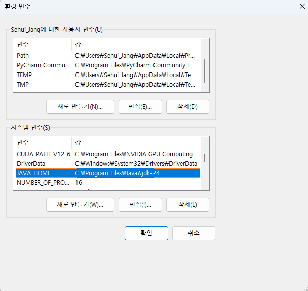

And then, double-click system variable 'Path'(not user variable).  
Register a new value "%JAVA_HOME%\bin".

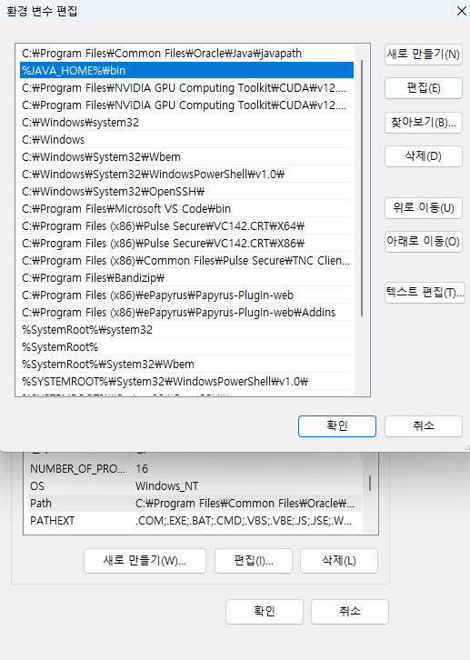

### 3. Check the version of JDK
Well, let's check whether JDK is fine.  
Turn on 'cmd', and try typing 'javac -version'.  
You must be able to see the version of javac.  
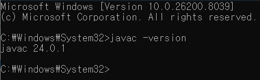

## Installing Kotlin Compiler
### 1. Installing file
Link: https://github.com/JetBrains/kotlin/releases

Take scrolling down, and download 'kotlin-compiler-x.x.x.zip'. You can set the target path at which you download .zip file.  
Unzip the .zip file, and find the folder 'bin'.  
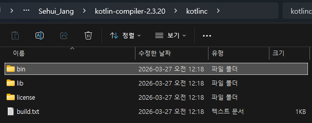

### 2. Setting environmental variable
Don't forget to set the system environment variable in the same way as in the case of JDK!  
Type the path to folder 'bin'.
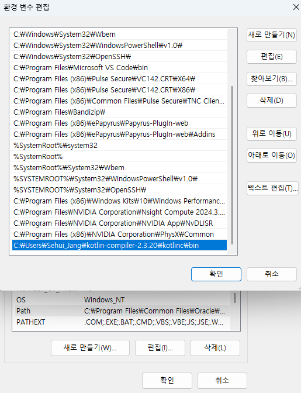

### 3. Check the version of Kotlin Compiler
In the same manner as in JDK, you can check whether Kotlin Compiler (kotlinc) is installed successfully, typing 'kotlinc -version' into 'cmd'.
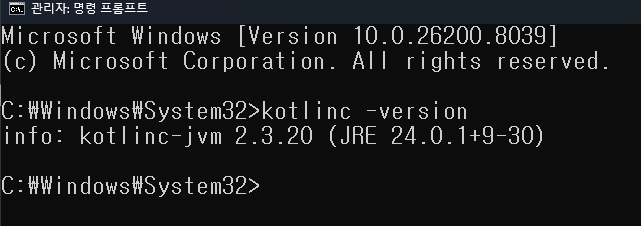

## Installing Code Runner in VSCode, Kotlin Language Extension
Now, let's turn on VSCode to install two extensions.
### 1. Code Runner
This extension is helpful in that it allows you to easily run various programming languages (including Kotlin) and check the results.
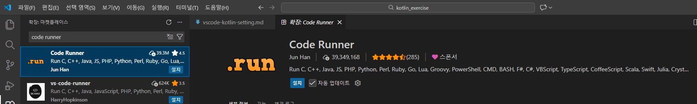

### 2. Kotlin Language Extension
It features syntax highlighting, code snippets, and region code folding.
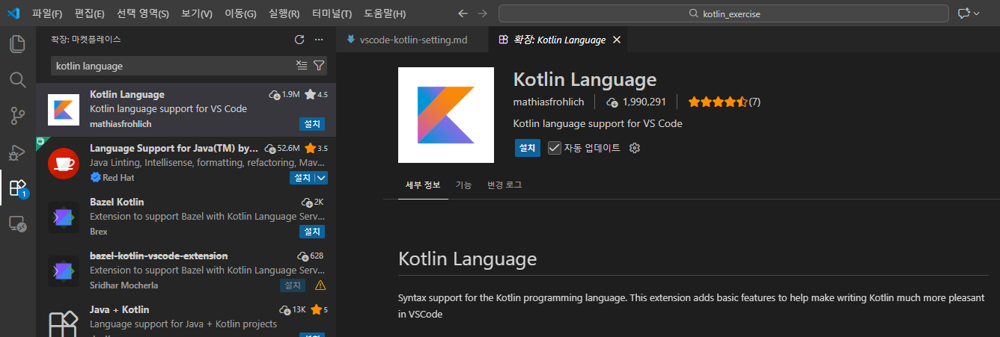

### 3. Setting Code Runner in VSCode
In VSCode, go into 'setting', search 'code-runner', and click the editing button highlighted in the below image.  
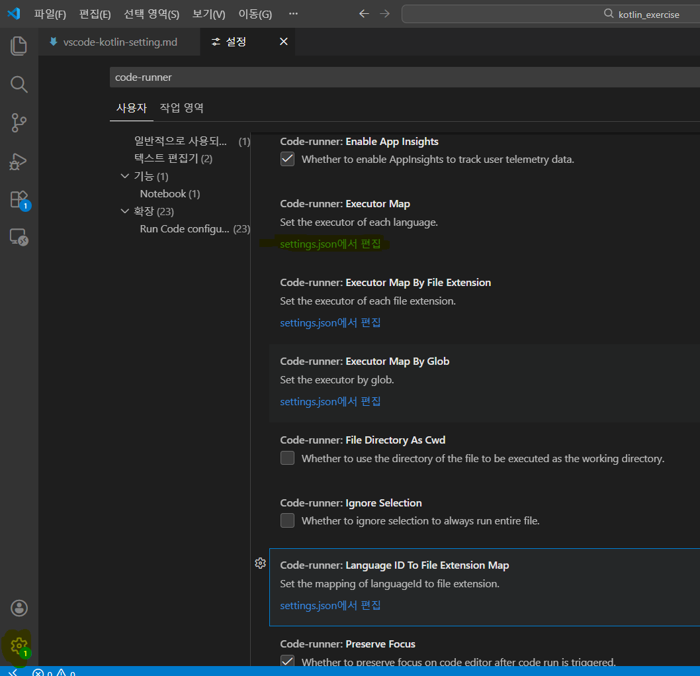

Please add key "kotlin" and its corresponding value:
   - "kotlin": "cd $dir && [Path to kotlinc in the installation file of kotlinc '...\\kotlinc\\bin\\kotlinc'] $fileName -include-runtime -d $fileNameWithoutExt.jar && java -jar $fileNameWithoutExt.jar",

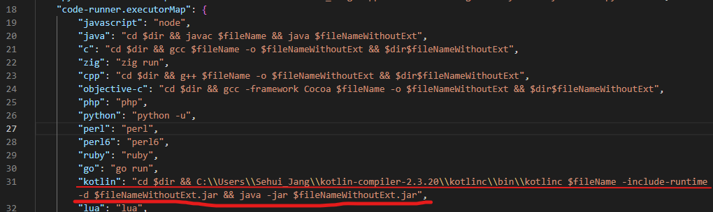

## Execute a simple Kotlin code
Create a new `.kt` file, and then write down the following code.  
Now, click the button 'Run Code' or use shortcut ctrl+alt+n.
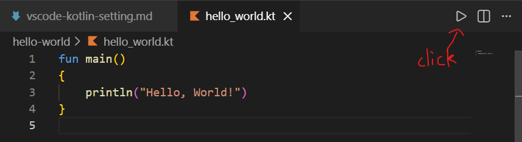

If being successful, you can look at a few lines of output, as follows:
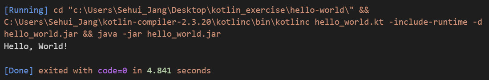
